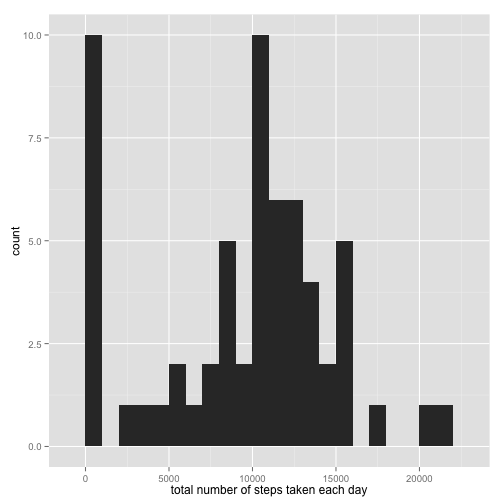
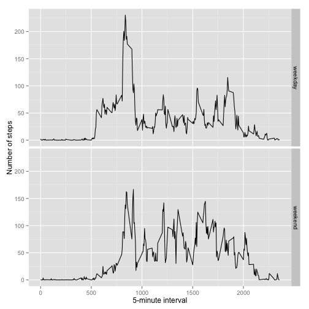

library(knitr)
opts_chunk$set(fig.path = "./figures/") # Set figures path

## Loading and preprocessing the data

```r
unzip(zipfile="activity.zip")
data <- read.csv("activity.csv")
```

## What is mean total number of steps taken per day?

```r
library(ggplot2)
totalSteps <- tapply(data$steps, data$date, FUN=sum, na.rm=TRUE)
qplot(totalSteps, binwidth=1000, xlab="total number of steps taken each day")
```

 

```r
mean(totalSteps, na.rm=TRUE)
```

```
## [1] 9354.23
```

```r
median(totalSteps, na.rm=TRUE)
```

```
## [1] 10395
```

## What is the average daily activity pattern?

```r
library(ggplot2)
dailyAve <- aggregate(x=list(steps=data$steps), by=list(interval=data$interval),
                      FUN=mean, na.rm=TRUE)
ggplot(data=dailyAve, aes(x=interval, y=steps)) +
    geom_line() +
    xlab("5-minute interval") +
    ylab("average number of steps taken")
```

 

On average across all the days in the dataset, the 5-minute interval contains
the maximum number of steps?

```r
dailyAve[which.max(dailyAve$steps),]
```

```
##     interval    steps
## 104      835 206.1698
```


## Imputing missing values

Find out the number of days with missing values.


```r
missingVal <- is.na(data$steps)
# How many missing
table(missingVal)
```

```
## missingVal
## FALSE  TRUE 
## 15264  2304
```

Fill the missing values with mean value for that 5-minute interval.


```r
# Replace each missing value with the mean value of its 5-minute interval
fillVal <- function(steps, interval) {
    filled <- NA
    if (!is.na(steps))
        filled <- c(steps)
    else
        filled <- (dailyAve[dailyAve$interval==interval, "steps"])
    return(filled)
}
filledData <- data
filledData$steps <- mapply(fillVal, filledData$steps, filledData$interval)
```

Make a histogram of the total number of steps taken each day and calculate the 
mean and median total number of steps.


```r
totalSteps <- tapply(filledData$steps, filledData$date, FUN=sum)
qplot(totalSteps, binwidth=1000, xlab="total number of steps taken each day")
```

 

```r
mean(totalSteps)
```

```
## [1] 10766.19
```

```r
median(totalSteps)
```

```
## [1] 10766.19
```

Mean and median values are higher after imputing missing data. This is because
days with 'steps' values 'NA' are now replaced with mean 'steps' value, causing
mean and median values to be higher than before.

## Are there differences in activity patterns between weekdays and weekends?

First, code the day as weekday or weekend.


```r
weekDayEnd <- function(date) {
    day <- weekdays(date)
    if (day %in% c("Monday", "Tuesday", "Wednesday", "Thursday", "Friday"))
        return("weekday")
    else if (day %in% c("Saturday", "Sunday"))
        return("weekend")
    else
        stop("invalid date")
}
filledData$date <- as.Date(filledData$date)
filledData$day <- sapply(filledData$date, FUN=weekDayEnd)
```

Then make a panel plot containing plots for weekdays and weekends.


```r
averages <- aggregate(steps ~ interval + day, data=filledData, mean)
ggplot(averages, aes(interval, steps)) + geom_line() + facet_grid(day ~ .) +
    xlab("5-minute interval") + ylab("Number of steps")
```

 

In general, the average number of 'steps' seem higher on weekend than weekday.
